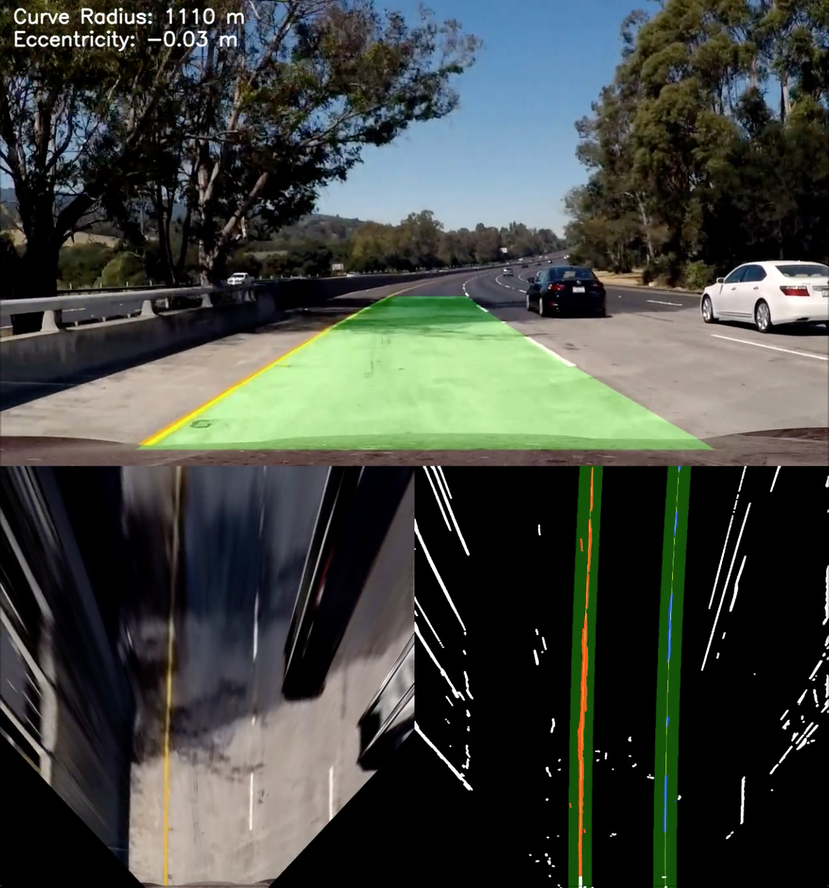
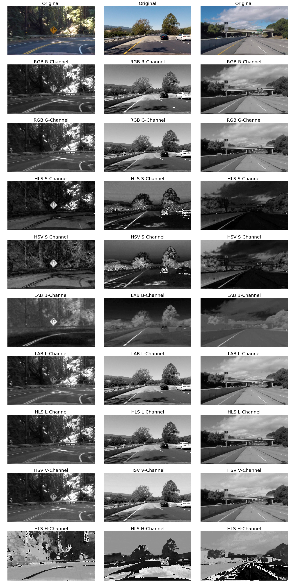
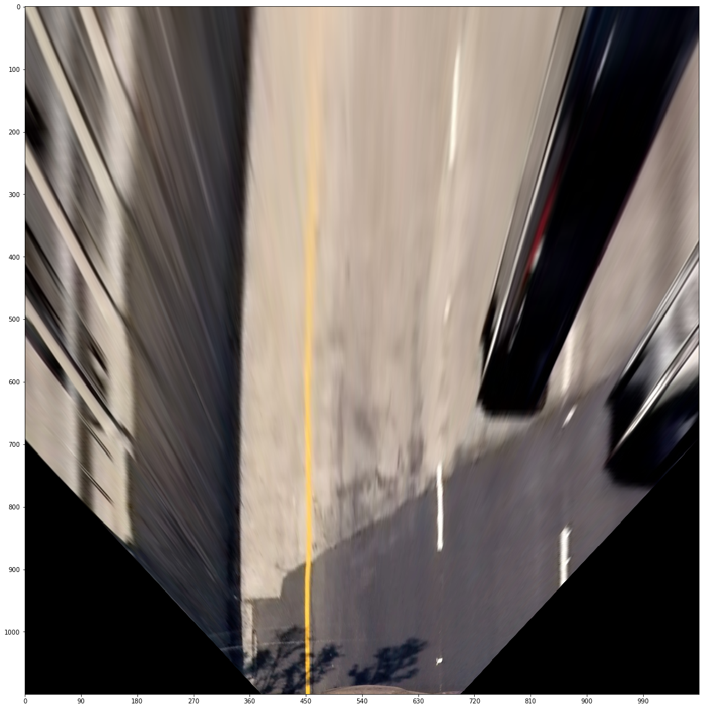
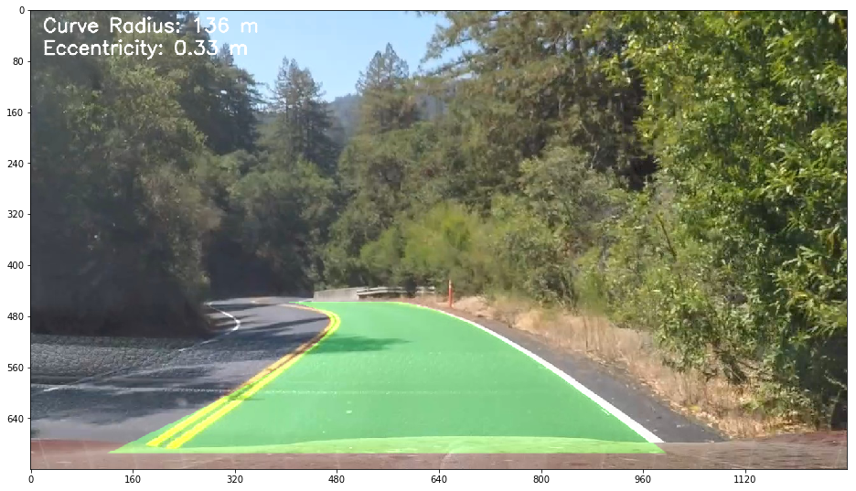
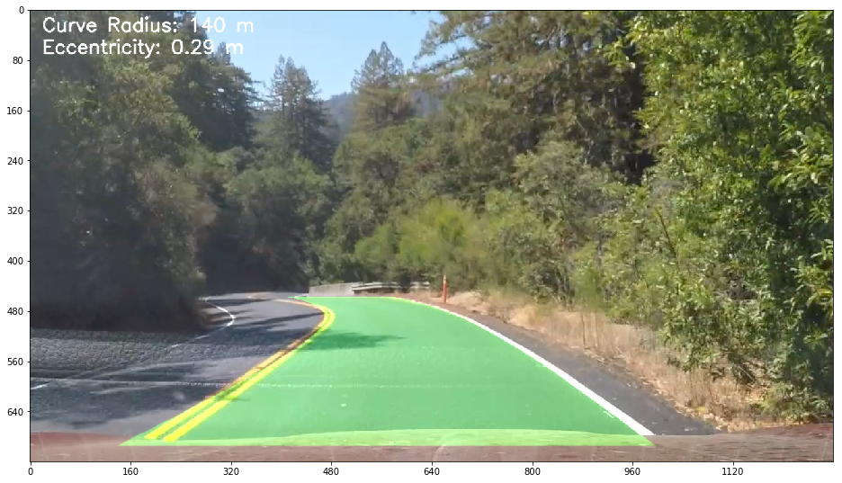
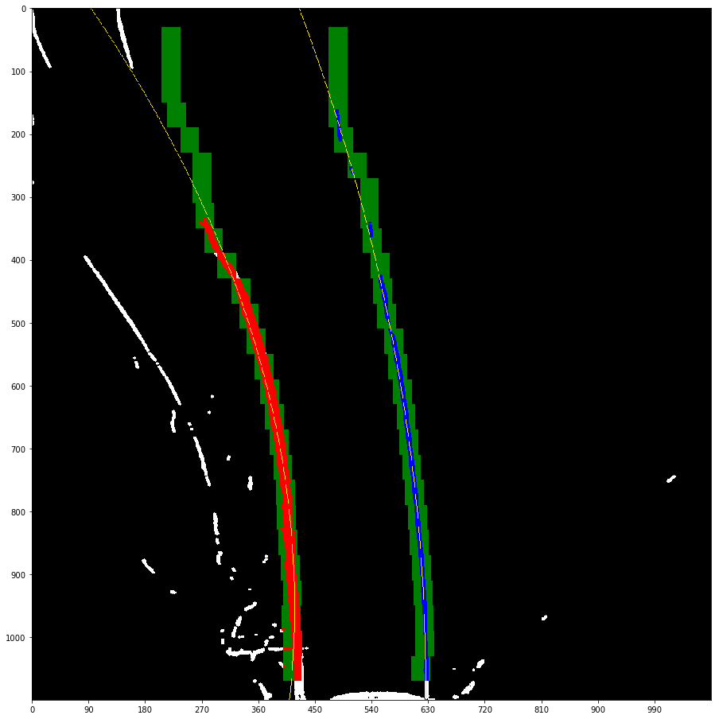
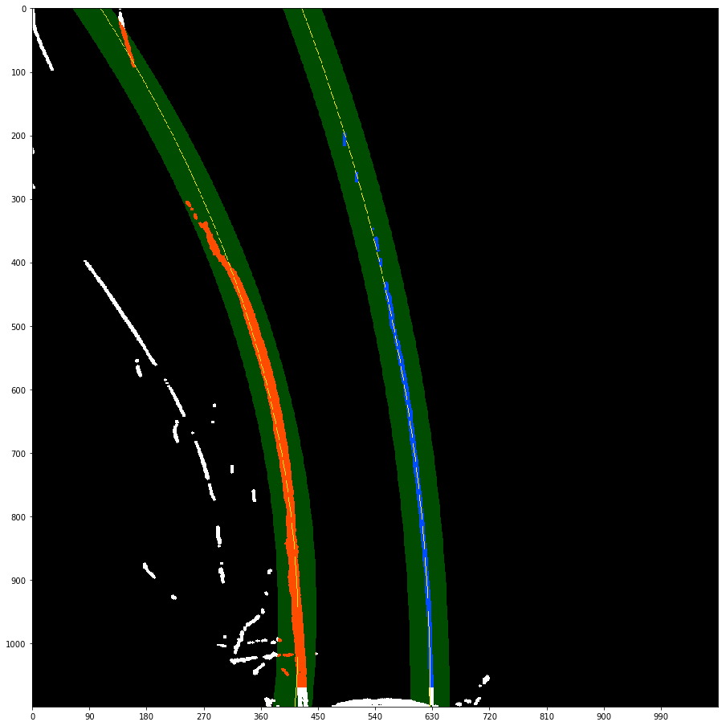

## Lane Tracker

### 1. Introduction

This repository contains a lane detection and tracking program that uses a traditional (i.e. non-machine-learning) computer vision approach to detect lane lines under the following circumstances:

1. Can detect curved lane lines with shapes that can be described by a second-degree polynomial.
2. Detects exactly two lane lines, which are the left and right lane lines delimiting the lane that a vehicle is currently driving in. The lane lines of adjacent lanes cannot be detected. Detection will not work if the vehicle is not currently inside a lane and oriented along the direction of the lane.
3. If one of the two lane lines is successfully detected, but the other one is not, then the detection will be discarded as invalid. The reason for this is that the algorithm can only evaluate the validity of a detection if two lines were detected.
4. The purpose of this implementation is to demonstrate the capabilities of this approach, not to provide a real-time detector, which would obviously need to be implemented in a compiled language.

Demo videos:
1. [Demo 1: Highway with dark pavement](https://www.youtube.com/watch?v=FJnjzTTTD9Y)
2. [Demo 2: Highway with uneven pavement](https://www.youtube.com/watch?v=DviOI8wrPp8)
3. [Demo 3: Curvy road with varying slope and lighting](https://www.youtube.com/watch?v=GdViO6M4xYE)

### 2. Basic Use Instructions

The main purpose of this repository is to demonstrate the approach explained further below. The program uses camera calibration and perspective transform matrices that depend on the resolution of the video/image, the camera used to record it, and its mount position (i.e. the camera's exact perspective on the road). It is therefore not straight forward to use on your own videos or images. Here are some basic use instructions nonetheless.

Clone or fork this repository.

In order to process a video:

1. Open the file process_video.py with an editor.
2. Set the file path of the video to be processed and the name of the desired output video.
3. Set the file paths to load camera calibration and warp matrices. The camera calibration and warp matrices in this repository are for an input resolution of 1280x720 and a dashboard camera mounted at the top center of the windshield of a sedan. These matrices will only serve as very rough approximations for your own camera and setup. In order to generate a camera calibration matrix for your camera, please consult [this OpenCV tutorial](http://docs.opencv.org/2.4/doc/tutorials/calib3d/camera_calibration/camera_calibration.html). In order to generate warp matrices and meters-per-pixel conversion parameters, please consult [this Jupyter notebook](perspective_transformation.ipynb).
4. Set all the options in the LaneTracker constructor, particularly the input image size and the size of the warped images that will result from the perspective transformation.
5. Once all these parameters are loaded/set, execute the file from the console:
`python process_video.py`

Note: The processing of the video frames is performed by the `process()` method of the LaneTracker object. Since this method is passed to the `fl_image()` of VideoFileClip as an argument, you need to set all of the desired options for `process()` as default argument values. In order to do so, open lane_tracker.py and set the argument values accordingly.

In order to process a single image:

1. Instantiate a LaneTracker object as shown in process_video.py.
2. Call the object's `process()` method.

### 3. Dependencies

1. Python 3.x
2. Numpy
3. OpenCV
4. MoviePy (to process video files)
5. Pickle (to load the camera calibration and warp matrices in this repository)

### 4. Description of the Algorithm

All code references in this section refer to the module lane_tracker.py. The `process()` method of the LaneTracker class aggregates the individual steps outline below.

The rough steps of the algorithm are:

1. Distortion is removed from the input image using a camera matrix and distortion coefficients.
2. The input image is warped into the bird's eye view (BV) perspective.
3. Various adaptive filtering, color thresholding, and morphological operations are performed by `filter_lane_points()` to yield a binary version of the BV image in which filtered pixels are white and all other pixels are black.
4. One of two search methods (`sliding_window_search()` or `band_search()`) is applied to the binary image to separate lane pixels from noise. The goal of the search methods is to identify exactly two lane lines.
5. Second-degree polynomials are fit to the detected lane pixels for the left and right lane line (`fit_poly()`).
6. A validity check is performed to evaluate whether the detected lane lines are plausible (`check_validity()`).

#### 4.1 Perspective Transformation

The program transforms input images into the bird's eye view perspective before processing them further. There are upsides and downsides to doing this.

Among the downsides is that this transformation is an approximation to the true perpendicular view onto the road from above in that it assumes that

1. the road is a plane and
2. the vehicle's velocity vector is parallel to that plane at all times.

Both of these assumptions are false almost all of the time. There are bumps in the road and the slope of the road is almost never constant, which leads to the vehicle's velocity vector not being parallel to the surface of the road lying ahead. Nonetheless the approximation is sufficiently accurate in many situations.

Among the upsides of the BV transformation is that it makes the search methods `sliding_window_search()` and `band_search()` more reliable, because valid lane lines will be (nearly) parallel in the BV perspective, information which the search methods can use to search for lane line pixels in a more targeted way. It also facilitates the evaluation of whether a pair of detected lane lines is valid.

You can find details about how the perspective transform is calibrated in [this Jupyter notebook](perspective_transformation.ipynb).

#### 4.2 Filtering

After the perspective transform, a number of adaptive filtering, color thresholding, and morphological operations are performed by `filter_lane_points()` to yield a binary version of the BV image in which filtered pixels are white and all other pixels are black.

Let's take a step back though. The goal is to identify lane lines, so it is crucial to have a clear understanding of some optical properties of lane lines (on US roads):

1. Lane lines have one of two colors, white or yellow.
2. Typically, the surface on **both** sides of a lane line has lower brightness and/or saturation and a different hue than the line itself.
3. Lane lines are not necessarily contiguous, so the algorithm needs to be able to identify individual line segments as belonging to the same lane line.

The former two properties define the filtering process.

The first step for the design of this process was to analyze individual color channels of various color spaces and combinations of them in the search for those channels that are able to best separate lane line pixels from all other pixels. A comparison of all channels of the RGB, HLS, HSV, LAB and YUV color spaces on a wide variety of test images yielded the following results. Out of all color channels tested:

1. The B-channel of the LAB color space is the strictly superior representation to identify yellow lane lines. It is most resistant against changes in lighting and has the highest signal-to-noise ratio.
2. The R-channel of the RGB color space is the overall superior representation to identify white lane lines. Some other color channels show comparable results on some or all test images, but no other color channel (or combination) works better, except on rare exceptions.

These two color channels are used to filter yellow and white lane lines separately.

Here is an excerpt of the color space comparison:

Next, the tophat morphology (cv2.morphologyEx()) is applied to both isolated color channels to filter shapes that are brighter than their surroundings. In addition to keeping only shapes that are brighter than their surroundings, the tophat morphology also keeps only shapes that fit inside the kernel (although this is a bit of an imprecise explanation), so large bright objects are also filtered out. This is good, because lane lines are narrow objects.

Next, a pixel intensity threshold is applied to both isolated color channels individually. Since hue, saturation and brightness of the same object change under different lighting conditions, a global, fixed pixel intensity threshold would be useless. The same white lane line could have a R-channel intensity value of 120 when it's cloudy or of 230 when the sun is shining. Hence a local and adaptive threshold is needed.

`filter_lane_points()` can use one of two local adaptive threshold functions: OpenCV's cv2.adaptiveThreshold() or my own bilateral_adaptive_threshold() (for the lack of a better name), which is defined at the top of lane_tracker.py. The program makes use of both thresholding functions (see further below why), but in the vast majority of all cases it uses the more important `bilateral_adaptive_threshold()`. I wrote this function because a simple adaptive thresholding function like `cv2.adaptiveThreshold()` does not fit the needs for this problem.

With a simple adaptive thresholding function like cv2.adaptiveThreshold(), a given pixel passes the threshold if it has a higher intensity value than the average (or some weighted average) of its surrounding pixels (possibly plus some additive constant). While this is useful to filter bright lane lines, unfortunately it also keeps the contours of any large bright areas in the image that are surrounded by darker areas, and so a lot of noise will pass the threshold. This is because it doesn't matter to the threshold whether a pixel is brighter than the surrounding pixels in both half-planes around it or whether it is only brighter than the surrounding pixels in one half-plane but not in the other. Remember, lane lines have the property that both sides of the line are darker than the line itself, so we want to make use of this property.

In contrast, the bilateral adaptive threshold function uses a cross-shaped kernel of 1 pixel thickness that, for a given pixel, computes the average intensities of the left, right, upper, and lower parts of the cross **separately**. In order to pass the threshold, a given pixel is required to be brighter than either **both** the left and right averages or **both** the top and bottom averages. Here is an illustration of the implications this has:

Here is an example image and its warped version:

| Original Image | Warped Image |
|:--------------:|:----------------:|
|  |  |

Here are two thresholded versions of the warped image above, one using the bilateral adaptive threshold function and the other one using OpenCV's `adaptiveThreshold()`, both applied to the raw warped color channels with no prior tophat morphology (more about that below):

| cv2.adaptiveThreshold() | bilateral_adaptive_threshold() |
|:--------------:|:----------------:|
|  |  |

The lane lines are clearly visible in both binary images, but there is more noise in the left image. You can see a strong line left of the left lane line in the left image. Why is it there in the left image, but not in the right one? The sharp shadow cast by the guardrail causes the pixels immediately next to it to be brighter than their overall average neighborhood, and so they pass the threshold in `cv2.adaptiveThreshold()`. In `bilateral_adaptive_threshold()` they don't pass the threshold, because these pixels are only brighter than what's on the left of them, but not what's on the right of them. For the same reason you can see white pixels in the left image at the points where the pavement suddenly turns from dark to light gray, and at the points where the black car is surrounded by light pavement. Most of this noise isn't there in the right image.

That's not the whole story though. If you apply a tophat morphology before the threshold, it makes the results with `cv2.adaptiveThreshold()` a lot better than without, because the tophat morphology already eliminates many bright shapes that are too large or shapes that aren't brighter than two sides of their neighborhood. Hence it is possible to get similar results with a combination of `cv2.adaptiveThreshold()` + tophat as with `bilateral_adaptive_threshold()`, but when I compared the results I found that the bilateral threshold still works a little better.

`filter_lane_points()` still uses `cv2.adaptiveThreshold()` **without** a prior tophat morphology in some cases though. Why is that? Consider a case where the lane lines aren't visible. They might be covered by foliage as in the third demo video with the curvy road, they might simply not be there, or whatever else could happen. If, however, there still happens to be a clear-cut intensity contrast between the lane pavement and the side of the road, then `cv2.adaptiveThreshold()` has a much higher chance of finding such a line than `bilateral_adaptive_threshold()`, because this time we're not looking for a lane line where both sides of the line are darker than the line itself. This time it's good enough if one side of the line is brighter than the other (e.g. the foliage is brighter than the road pavement). The algorithm therefore can try this as a second attempt, a fallback, whenever it wasn't able to find lane lines with `bilateral_adaptive_threshold()` at the first attempt.

`filter_lane_points()` also has a `mask_noise` feature. This feature uses the LAB B-channel in an additional stage to filter out background noise in the image. It is mostly targeted at greenery. This masking stage is activated by default, but it is deactivated when `cv2.adaptiveThreshold()` is used so that said foliage from the example above doesn't get eliminated from the image in case it is needed.

The last step of the filtering process is to apply an open morphology to the binary image. The open morphology first erodes the white pixel shapes by the kernel size and then dilates what remains left, resulting in the elimination of smaller noise parts in the image. This improves the robustness of the thresholding quite a bit.

#### 4.3 Search Modes

The result of the filtering stage is a binary image in which filtered pixels are white and all other pixels are black. Next, one of two possible search algorithms, `sliding_window_search()` and `band_search()`, tries to identify lane pixels among the white pixels.

The combination of these two search methods becomes relevant when multiple consecutive frames are processed.

`sliding_window_search()` is the search method used whenever no valid lane line detections are available from recent previous frames. It scans the image by iterating two separate small rectangular search windows (one for each lane line) from the bottom to the top of the image. In each successive iteration, the two search windows can slide to the left and right within a certain range around the horizontal center of their respective preceding search windows. The width and height of the search windows and the search range (how far to the left and right of the previous window center to search) largely determine the performance of this search method. Both search windows generally move in the direction where they find the most white pixels. If one search window does not find any white pixels in a given iteration, which often happens because the white lane lines are dashed, it moves in the same direction as the other search window. This is one reason why the BV perspective is useful: Since the lane lines are (nearly) parallel in this perspective, one search window can determine the correct moving direction for both of them.

`band_search()` is the search method used whenever valid lane line detections are available from recent previous frames. It searches for lane line pixels in a narrow band of specified width around the previous polynomial graph. Lane lines move approximately continuously across the frames of a video stream, i.e. if there is a lane line at a certain position in a frame, then that lane line must be within a certain narrow neighborhood of this position in the subsequent frame. This is why searching for lane line pixels within a narrow band around previous lane line detections works. This search method is a lot more robust than the sliding window search.

Here is an example from the third demo video to visualize these two search processes. The left image is the first frame of the sequence in this example and so the algorithm must use the sliding window search. The right image is the second frame and so it can use the two lane lines found in the first frame to perform a band search around them to find the next lane lines. The search area is highlighted in green, the detected lane pixels are highlighted in red and blue, and graphs of the resulting fitted polynomials are shown in yellow.

| First Frame Result | Second Frame Result |
|:--------------:|:----------------:|
|  |  |
| First Frame: Sliding Window Search | Second Frame: Band Search |
|  |  |

#### 4.4 Curve Radius and Eccentricity

`get_curve_radius()` computes the curve radius and `get_eccentricity()` computes the car's distance from the center of the lane. The computation of the eccentricity is straight forward and uses conversion factors from pixels to meters that were calculated based on the warped images. The computation of the curve radius happens according to the formula that can be found [here](http://www.intmath.com/applications-differentiation/8-radius-curvature.php), once again using the metric conversion factors. The y-value at which the curve radius is computed is the bottom of the image.

### 5. Brief Discussion

One conclusion from my experiments was that, for this particular problem, color thresholding worked better than gradient thresholding and the program is more robust without applying any gradient thresholding at all. The objects we're trying to detect here (lane line segments) have a relatively simple structure (compared to detecting cars, for example) and are clearly defined by just color and size (we're looking only for shades of white and yellow of a certain minimum thickness that start close to the bottom of the image) and by the fact that they are brighter than their surrounding pixels. These properties of the objects of interest allow us to get good results using just color thresholding (and some morphologies, but no gradients). In my experiments, color thresholding accounted for the vast majority of the exposed lane line pixels, while gradient thresholding added little value on top of that, but at the same time contributed the majority of the noise in the filtered image. Using a bilateral adaptive color threshold has a similar effect as using a gradient threshold, only better.

One big problem that becomes apparent in the third demo video is the constantly changing slope of the road. As explained above, the warp matrix used for the perspective transform is static and assumes that the road ahead is flat from the vehicle's perspective. If that assumption does not hold, lines that should be parallel in the warped image will no longer be parallel. This makes it a lot harder to assess the validity of detected lane lines, because even if the lane lines in the warped image are not nearly parallel, they might still be valid lane lines. One (bad) way to compensate for this is to relax the criteria that evaluate lane line validity in `check_validity()`, otherwise the program would reject too many valid lane lines. This relaxation of the validity criteria also leads to some detections passing for valid lane lines even though they should have been rejected, so this solution is not ideal.

### 6. ToDo

* Turn all absolute pixel values into relative values in all function parameters.
